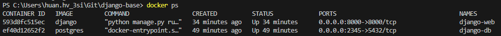
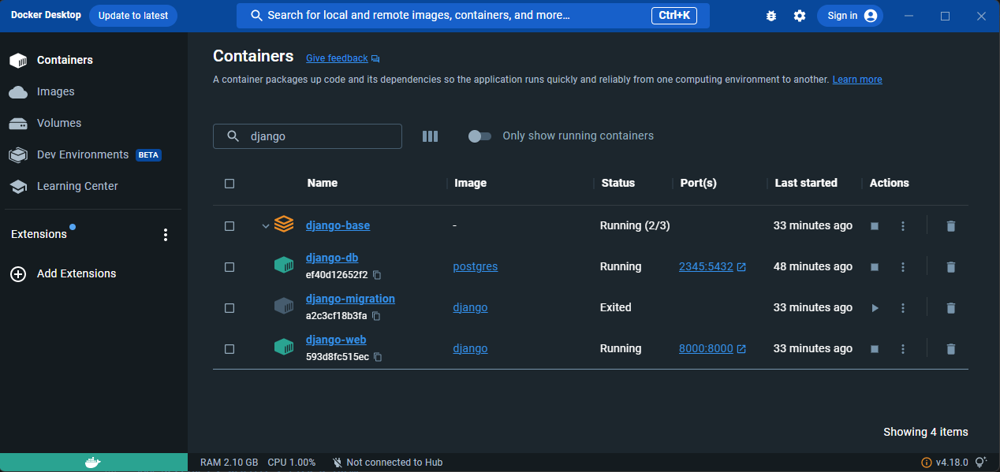
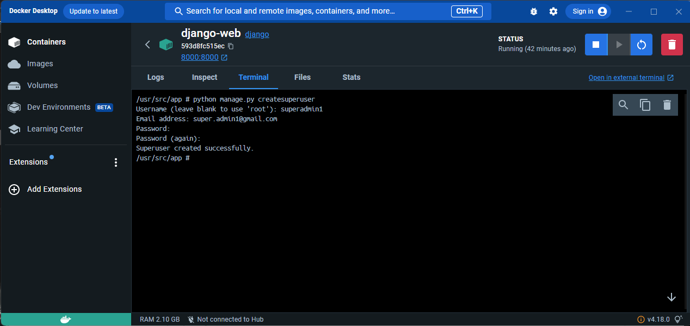
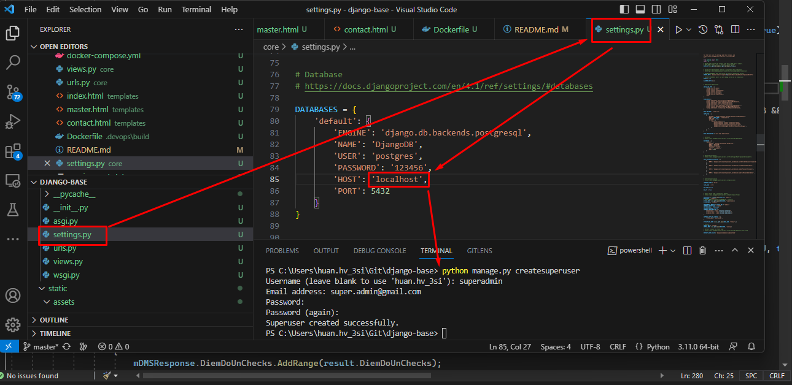

# DJANGO BASE

## Mục lục

1. [Điều kiện tiền đề](#điều-kiện-tiền-đề)
2. [Cài đặt](#cài-đặt)

##  Điều kiện tiền đề

Cài [docker](https://docs.docker.com/get-docker/) và [docker-compose](https://docs.docker.com/compose/install/) phiên bản mới nhất

## Cài đặt

### Clone repo này
### Xóa thư mục **.git**
- `rm -rf .git/`
### Tạo mới git repo
- `git init`
- `git add .`
- `git commit -m "Initial Commit"`
### Chạy Django tại http://localhost:8000
Chạy 3 container **django-web**, **django-db** và **django-migration** bằng lệnh:
- `docker-compose build`
- `docker compose up -d`
hoặc
- `docker-compose up -d --build`
Kiểm tra xem container đã lên chưa bằng lệnh:
```docker ps```

hoặc kiểm tra trên Docker Desktop 

### Tạo superuser
- `python manage.py createsuperuser`
Nếu có Docker Desktop thì nhấn vào Container -> django-web -> Terminal rồi chạy câu lệnh trên.

Nếu chạy trực tiếp trên terminal visualcode thì chỉnh sửa file settings.py, DATABASES 'HOST'='localhost'

